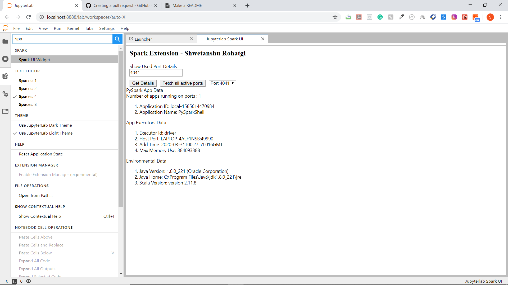

# jupyterlab_sparkui


A jupyterlab extension to show preview of Spark-UI

# Jupyter SparkUI Extension Widget
 

## Widget Features:
**1. Searching and Fetching Active clusters:**
<br />
&nbsp;&nbsp; The jupyterlab widget when launched produces a UI that lets you fetch all the Ports that are running Spark jobs on various available ports. We use recursive approach to get all ports that are running spark API starting from port 4040. 
<br /><br />
**2. Render App Summary and log any Errors: Spark Applications Context**
<br />
&nbsp;&nbsp;The widget pulls a small summary of Spark API that are running on various ports including information related to Application ID, Memory requirements, Enviroment Settings/Versions, Executor information etc. Also incorporated error handling if API fails for any reason!
<br /><br />
**3. Dynamically Rendering Apps Spark UI**
<br />
	&nbsp;&nbsp;Icorporated forward-proxy all the inherited links to the extension’s base URI letting the IFramed on the extension itself.  
<br />
<br />
<br /><br />
**4. Handling CORS issue (Inprogress)**
<br />
	&nbsp;&nbsp;Calling Spark API on the backend to implement a simple client-server architechure that will avoid CORS issues.   
<br />
<br />

## Showcasing Prerequisites :
<a href src = "https://drive.google.com/file/d/1yNzD5-z59KEsebwB5mnlVDQkdt28qT6q/view?usp=sharing">Review Video Demo for feature</a>
<br />

## Requirements

* JupyterLab >= 1.0

## Install

```bash
jupyter labextension install jupyterlab_sparkui
```

## Contributing

### Install

The `jlpm` command is JupyterLab's pinned version of
[yarn](https://yarnpkg.com/) that is installed with JupyterLab. You may use
`yarn` or `npm` in lieu of `jlpm` below.

```bash
# Clone the repo to your local environment
# Move to jupyterlab_sparkui directory
# Install dependencies
jlpm
# Build Typescript source
jlpm build
# Link your development version of the extension with JupyterLab
jupyter labextension link .
# Rebuild Typescript source after making changes
jlpm build
# Rebuild JupyterLab after making any changes
jupyter lab build
```

You can watch the source directory and run JupyterLab in watch mode to watch for changes in the extension's source and automatically rebuild the extension and application.

```bash
# Watch the source directory in another terminal tab
jlpm watch
# Run jupyterlab in watch mode in one terminal tab
jupyter lab --watch
```

### Uninstall

```bash
jupyter labextension uninstall jupyterlab_sparkui
```

