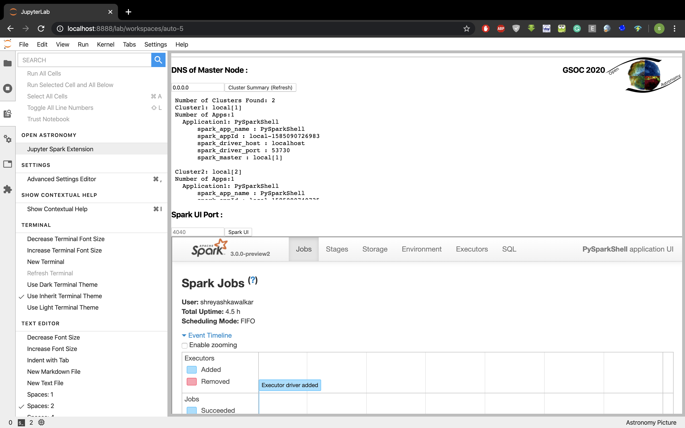

# JupyterSparkExt Widget
 
## Features and Functionalities:
**1. Auto searching of active Cluster on Local System:**
 
&nbsp;&nbsp; The jupyterlab widget server extension by default upon activation starts fetching for the active spark clusters and its application on the localhost for ports within range 4040 :4049. Or by manually providing a choice of port
  
**2. Auto searching of active Cluster on Remote System:**
 
&nbsp;&nbsp;The jupyterlab widget server extension provides a slot to insert master node DNS, that starts fetching for an active spark clusters of a remote system with its application for ports within range 4040 : 4049,  or by manually providing a choice of port.
  
**3. Summarising and presenting Spark Applications’ Context**
 
&nbsp;&nbsp;The extensions summarises the fetched spark clusters’ metadata, which user can directly copy, to get connected to the spark application of their choice.
  
**4. Rendering Applications Spark UI of choice**
 
	&nbsp;&nbsp;Another main feature is to provide access to monitor any application of the SparksUI on the extension, on a local system or even on a remote system. The extensions Web-Scraps the SparkUI and forward-proxy all the inherited links to the extension’s base URI so that it can be IFramed on the extension itself. 
 
 
## System Components:
* **Dynamic Interactive UI:**
&nbsp;&nbsp;Pardon me for the present UI =D. The UI dynamically manages to handle IFrame window resolution based upon user access. 
* **Server Extension for programmatic APIs :**
&nbsp;&nbsp;TThis enables us to render a  python package that sustains all the programmed scripts and scrapes web using  Request Handlers like tornado to reduces complexity on JS.  
* **IFrames with Proxy Server by WebScrapping**
&nbsp;&nbsp;In order to render a webapp directly onto the widget and provide the embedded links of the webapp, WebScrapping enables developers to proxy forward them for customising the webapp.  
* **Pyspark for python - spark cluster programmatic Integration** 
* **Spark Cluster deployment**

## Showcasing Prerequisites :
[Please Click here for the illustrative video!]"https://youtu.be/41rFOkmNL-U"

 
**Time Series:** 
&nbsp;00:00 &nbsp;Pyspark to python environment for python spark programmatic APIs 
&nbsp;00:16 &nbsp;Spark cluster setting up 
&nbsp;00:34 &nbsp;Spark environment setting up in .bash_profile 
&nbsp;00:56 &nbsp;Deploying Multiple Spark Cluster and spark applications  
&nbsp;02:25 &nbsp;Launching JupyterLab widget extension: JupyterSparkExt 
&nbsp;04:40 &nbsp;Projecting same on Jupiter lab extension 
&nbsp;05:12 &nbsp;Rendering sparkUI for port of choice.  
&nbsp;06:05  &nbsp;With Help of Summary connecting with pyspark context
  

## Development Steps:

### Spark Cluster on standalone:

**pythonic spark library**
<pre>pip install pyspark</pre>

**Spark Cluster**
<pre>
wget https://downloads.apache.org/spark/spark-3.0.0-preview2/
tar xfvz spark-3.0.0-preview2-bin-hadoop3.2
cd spark-3.0.0-preview2-bin-hadoop3.2
</pre>

**Open Terminal or go to system environment and add:**
<pre>
vi .bash_profile
export SPARK_HOME=~/spark-3.0.0-preview2-bin-hadoop3.2
export PATH=$SPARK_HOME/bin:$PATH
export PYSPARK_PYTHON=python3
#export PYSPARK_DRIVER_PYTHON="jupyter"
#export SPARK_LOCAL_IP="0.0.0.0"
#export PYSPARK_DRIVER_PYTHON_OPTS="notebook --no-browser --port=8888”
source bash_profile
</pre>

**test**
<pre>
 echo $SPARK_HOME
</pre>

### Spark Cluster with multiple local systems:
Configure router for traffic on port 80 
<pre>
sudo apt-get install openssh-server openssh-client
ssh-keygen -t rsa -P ""
</pre>
open .ssh/id_rsa.pub (of master) and copy content to .ssh/authorized_keys into  all the wokers as well as master 
Follow above mentioned steps in all the systems 
***on Master Node only:*** 
<pre>
sudo vi /etc/hosts

&lt;MASTER-IP&nbsp&gt; master
&lt;SLAVE01-IP&gt; worker01
&lt;SLAVE02-IP&gt; worker02
ssh worker01
ssh worker02
	
vi $SPARK_HOME/conf/spark-env.sh

export SPARK_MASTER_HOST="&lt;MASTER-IP>"
	
sudo vi $SPARK_HOME/conf/slaves

master
worker01
worker02
</pre>

### Spark Cluster on cloud AWS:
<pre>
sudo apt-get install awscli
aws configure set aws_access_key_id &lt;aws_access_key_id&gt;
aws configure set aws_secret_access_key &lt;aws_secret_access_key&gt;
aws configure set region &lt;region&gt;
[RUN] SPARK_AWS_EMR.ipynb
</pre>

### Spark Multi-Cluster with multiple application using terminal:
Open Terminal 
Deploying cluster 1 spark application 1 
<pre>pyspark —master local[0] —name c1_app1</pre>
Deploying cluster 1 spark application 2 
<pre>pyspark —master local[0] —name c1_app2</pre>
Deploying cluster 2 spark application 1 
<pre>pyspark —master local[1] —name c2_app1</pre>
Deploying cluster 2 spark application 2 
<pre>pyspark —master local[1] —name c2_app2</pre>

### Jupyter Spark Widget Installation:

**Application Server Extension:**
 
<pre>
git clone <link to repo>
cd JupyterSparkExt
pip install ~/JupyterSparkExt --pre
jupyter serverextension enable --py spark_ui_tab --sys-prefix
</pre>

**Rendering Widget:**
 
<pre>
jupyter labextension install . --no-build
jupyter labextension link .
jupyter lab 
# or
jupyter lab --watch
</pre>

  
